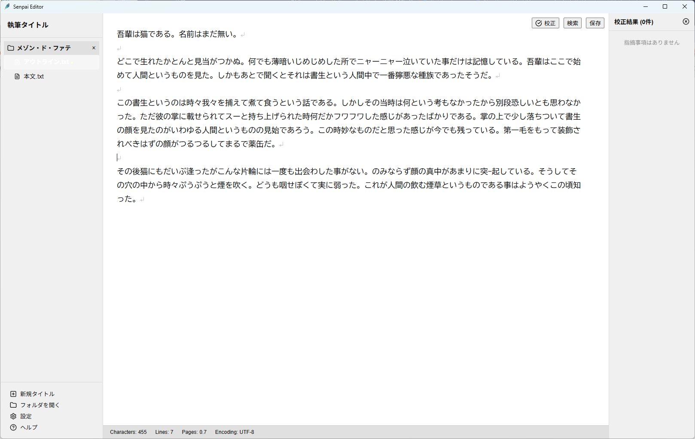
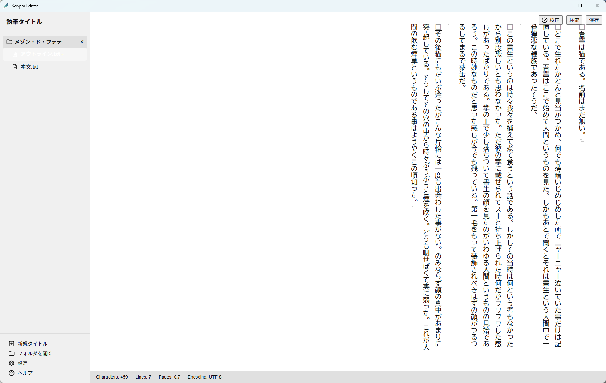
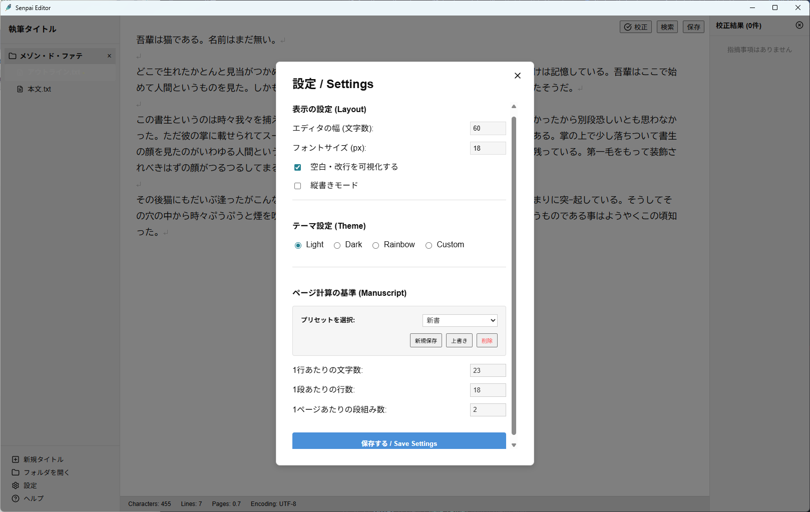

# 🖋️ Senpai Editor

> **「先輩が可愛いことを認めないと使えない、執筆活動を加速させる最強のテキストエディタ」**

Senpai Editor は、Tauri + React + TypeScript で構築された、小説同人誌執筆に特化したシンプルなテキストエディタです。
どうしてもテキストファイルで執筆したい・ページ数をなんとなく知りたい・虹色に光るエディタが欲しいなどの局地的需要を満たします。

---

## ✨ アプリケーションの特長

### 🖋️ 日本語小説特化の表示機能
- **縦書きモードサポート**: ワンクリックで縦書きに切り替え。ただ制作者があまり使わないので雑です。
- **原稿用紙換算計算**: 文字数だけでなく、設定した「1行の文字数」「1ページ内の行数」「段組み」に基づき、リアルタイムに「ページ数」を算出します。これは雑じゃないです。

### 🛡️ 安心の執筆サポート
- **20分自動保存機能**: 執筆に夢中になっても安心。バックグラウンドで20分おきにデータの書き込みを行います。
- **インテリジェント校正**: 連続する助詞、閉じ忘れの括弧、余計な句読点などをリアルタイムに検知し、改善を提案します。わりと雑です。
- **大文字・小文字区別検索**: 日本語入力に配慮した、高度な検索と一括置換機能を搭載。

### 🎨 自由自在なカスタマイズ
- **多彩なテーマ**:
  - ☀️ **Light**: 清潔感のあるライトモード。
  - 🌙 **Dark**: 目に優しい深みのあるダークモード。
  - 🌈 **Rainbow**: 背景がダイナミックに変化するクリエイティブなモード。まさにゲーミングエディタ。今夜はディスコナイト。
  - 🎨 **Custom**: 自分だけの配色を完全にコントロール。見やすさは自分で考えたいあなたに。
- **フレキシブルUI**: サイドバーの幅をドラッグで調整可能。設定は永続化され、次回の起動時も維持されます。

---

## 📸 スクリーンショット

### メインエディタ


### 縦書きモード

*※日本語小説に最適な縦書き表示をサポート。*

### 設定画面

*※フォントサイズや行間、テーマなどを詳細にカスタマイズ可能です。*

---

## 🛠️ インストールと開発

### 必要環境
- Node.js (v18+)
- Rust (Tauri のビルドに必要)

### 開発環境のセットアップ
1. このリポジトリをクローンします。
2. 依存パッケージをインストールします:
   ```bash
   npm install
   ```
3. 開発サーバーとアプリを起動（ホットリロード有効）:
   ```bash
   npm run tauri dev
   ```

### プロダクション・ビルド
本番用のインストーラー（NSIS / MSI）を生成するには以下のコマンドを実行します。
```bash
npm run tauri build
```
ビルド成果物は `src-tauri/target/release/bundle` ディレクトリ以下に出力されます。

---

## 📜 ライセンス

© 2026 unene.
Powered by **Tauri**, **Antigravity** & **Unene**.
